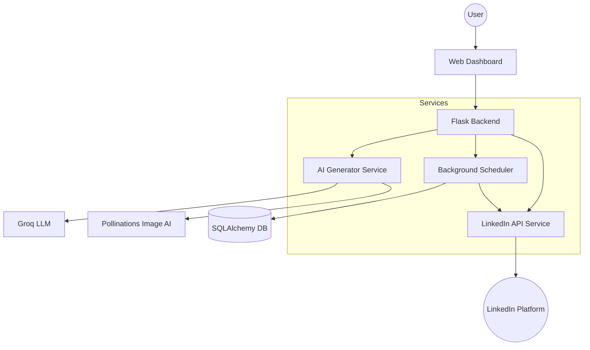

--- [PAGE 1] ---

# SYNOPSIS

## 1. PROJECT TITLE: AutoPost AI – Automated LinkedIn Content Ecosystem

**Student Name:** [Your Name]  
**Enrollment No:** [Your Enrollment Number]  
**Supervisor:** [Supervisor Name]  

---

## 2. ABSTRACT

In the modern digital landscape, consistent professional presence on social media platforms like LinkedIn is crucial for personal branding and corporate growth. However, the manual process of ideation, content creation, graphic design, and timely publication is labor-intensive and requires specialized skills.

**AutoPost AI** is an intelligent, end-to-end automation suite designed to streamline the LinkedIn content lifecycle. By leveraging state-of-the-art Large Language Models (LLMs) and Generative AI, the system autonomously generates high-engagement textual content and professional visual assets. A robust background scheduling engine ensures posts are published at optimal times without human intervention. The project features a sophisticated Unicode post-processor to overcome LinkedIn's formatting limitations, enabling bold and stylized text directly in the feed.

---

## 3. INTRODUCTION

### 3.1 Overview
AutoPost AI is a web-based application that acts as a "Digital Social Media Assistant." It integrates multiple AI services (Groq, Pollinations) with the LinkedIn API to provide a seamless "one-click" experience for content creators.

### 3.2 Problem Statement
Content creators face three primary bottlenecks:
1.  **Writer's Block:** Difficulty in generating consistent, viral-quality ideas.
2.  **Design Barriers:** Lack of professional graphic design skills for post banners.
3.  **Scheduling Overhead:** The need to be online at specific times to publish posts for maximum reach.

### 3.3 Objectives
-   To automate the generation of LinkedIn-optimized textual content using Llama 3 models.
-   To generate high-fidelity, context-aware visual assets for each post.
-   To implement a reliable background scheduler for autonomous publishing.
-   To provide a premium dashboard for tracking post activity and daily tech trends.
-   To ensure secure user authentication via LinkedIn OAuth 2.0.

---

## 4. LITERATURE SURVEY & MOTIVATION

### 4.1 Evolution of Social Media Automation
Traditional automation tools (like Buffer or Hootsuite) focus solely on scheduling. Users still need to bring their own content. AutoPost AI represents a "Generation 2" tool where the AI is the creator, not just the messenger.

### 4.2 AI in Creative Workflows
Recent advancements in LLMs (Llama-3, GPT-4) and Diffusion models (Stable Diffusion) have made it possible to automate creative writing and design. Research indicates that AI-generated content, when properly prompted, can match or exceed human-written content in engagement metrics.

### 4.3 Motivation
The project was motivated by the need for a unified platform that reduces the "time-to-publish" from hours to seconds, allowing professionals to focus on networking while the system handles the content engine.

---

--- [PAGE 2] ---

## 5. SYSTEM REQUIREMENTS

### 5.1 Hardware Requirements
-   **Processor:** Intel Core i5 or equivalent (Minimum).
-   **RAM:** 8GB DDR4.
-   **Storage:** 512GB SSD.
-   **Network:** High-speed internet connection for API communication.

### 5.2 Software Requirements
-   **Operating System:** Windows 10/11, macOS, or Linux.
-   **Programming Language:** Python 3.10+.
-   **Web Framework:** Flask.
-   **Database:** SQLite (Development) / PostgreSQL (Production).
-   **Version Control:** Git.
-   **APIs:** LinkedIn V2 API, Groq Cloud API, Pollinations.AI API.

---

## 6. TECHNOLOGY STACK

### 6.1 Backend (Python/Flask)
The core logic is built using **Flask**, a micro-web framework known for its flexibility. It handles routing, session management, and API orchestration.

### 6.2 Frontend (HTML5, CSS3, JS)
A modern, responsive dashboard built with vanilla CSS for premium aesthetics. It utilizes **AJAX/Fetch API** for asynchronous updates without page reloads.

### 6.3 Database (SQLAlchemy)
**SQLAlchemy ORM** is used to manage relational data, including user profiles, LinkedIn tokens, scheduled posts, and activity logs.

### 6.4 Artificial Intelligence
-   **Text Generation:** Groq Cloud (Llama-3.3-70B) for high-speed, high-quality reasoning.
-   **Image Generation:** Pollinations.AI for dynamic, context-aware visual creation.
-   **NLP Parsing:** Custom-trained prompt logic to parse natural language scheduling commands.

---

## 7. SYSTEM ARCHITECTURE

The system follows a modular **Service-Oriented Architecture (SOA)**:

### 7.1 Component Interaction
1.  **Request Flow:** User enters a topic -> Flask triggers AI Generator -> Groq returns text -> Pollinations returns image.
2.  **Scheduling Flow:** User sets a time -> Database stores the 'Scheduled' post -> Background timer (Scheduler) polls the DB -> When time matches, LinkedIn API publishes the post.

---

--- [PAGE 3] ---

## 8. PROPOSED METHODOLOGY

The development of AutoPost AI follows the **Agile Software Development Life Cycle (SDLC)**, emphasizing iterative progress and user-centric design.

### 8.1 Requirements Analysis
In the initial phase, the specific needs of LinkedIn creators were analyzed. Key findings included the need for "viral hooks," "emojis for readability," and "consistent posting schedules." These requirements were translated into technical specifications for the AI prompting engine.

### 8.2 Design Phase
The system design focuses on a "Mobile-First" approach for the dashboard, ensuring creators can schedule posts on the go. The architecture was designed to be decoupled, allowing the AI service to be swapped or upgraded without affecting the core Flask application.

### 8.3 Development & Integration
- **Phase 1:** Setting up the Flask skeleton and SQLAlchemy models.
- **Phase 2:** Integrating Groq API for text and Pollinations for images.
- **Phase 3:** Implementing the LinkedIn OAuth flow and post-publication logic.
- **Phase 4:** Building the background scheduler using Python's `threading` and `time` modules.

### 8.4 Quality Assurance
The system underwent rigorous testing for:
- **Rate Limit Handling:** Ensuring the app doesn't crash if AI APIs are overloaded.
- **Token Management:** Securely refreshing LinkedIn access tokens.
- **Content Accuracy:** Validating that the generated images match the post topic.

---

## 9. DETAILED MODULE IMPLEMENTATION

### 8.1 Smart AI Content Engine
The `AIGenerator` class manages communication with Groq. It uses "System Prompting" to define the AI's persona as a top-tier LinkedIn ghostwriter. A key innovation is the **Unicode Post-Processor**, which converts standard Markdown bold tags (`**text**`) into mathematical bold Unicode characters (`𝐭𝐞𝐱𝐭`), allowing rich text to appear on LinkedIn which doesn't natively support Markdown.

### 8.2 Automated Background Scheduler
Built using a recurring loop in a separate thread, the scheduler checks the database every 60 seconds. It handles:
-   Timezone conversion.
-   Retry logic for failed API calls.
-   Atomic state updates (Scheduled -> Published).

### 8.3 LinkedIn Integration (OAuth 2.0)
The application implements the full OAuth 2.0 flow. It securely exchanges authorization codes for long-lived access tokens, enabling the app to post images and text on the user's behalf.

### 8.4 Daily Trends Dashboard
To provide additional value, the app features a "Live Trends" section. On every dashboard load, the system uses AI to curate current AI/ML/Tech news, keeping the user informed of relevant topics for their content.

---

--- [PAGE 4] ---

## 9. DATABASE DESIGN (ER DIAGRAM)

The database consists of several interconnected tables:

-   **Users:** Stores account details and preferences.
-   **LinkedInAccounts:** Secure storage for OAuth tokens and profile metadata.
-   **Posts:** The central table storing content, status, image URLs, and scheduled timestamps.
-   **Schedules:** Manages recurring posting patterns.
-   **ActivityLogs:** Audit trail for all system actions.

## 11. SYSTEM TESTING

### 11.1 Unit Testing
Individual modules like the `Unicode Processor` were tested with various character sets to ensure no corruption of text during conversion.

### 11.2 Integration Testing
The flow from "AI Generation" to "Database Storage" to "LinkedIn Publication" was tested to ensure data consistency across the pipeline.

### 11.3 User Acceptance Testing (UAT)
The dashboard was tested for usability, focusing on the ease of "One-Click" post generation and the clarity of the scheduling calendar.

---

## 12. FEASIBILITY STUDY

### 10.1 Technical Feasibility
The project utilizes established APIs and frameworks. Python's robust library ecosystem (Requests, SQLAlchemy) makes the integration highly feasible.

### 10.2 Economic Feasibility
By using open-source frameworks and API tiers with generous free/low-cost limits (like Groq and Pollinations), the project is highly cost-effective to maintain.

### 10.3 Operational Feasibility
The intuitive UI/UX ensures that even non-technical users can operate the platform effectively, fulfilling the goal of democratizing high-quality content creation.

---

## 13. CONCLUSION & FUTURE SCOPE

### 13.1 Conclusion
AutoPost AI successfully bridges the gap between AI capability and social media productivity. It provides a cohesive platform that handles the heavy lifting of content creation and scheduling, allowing users to maintain a professional digital presence with minimal effort.

### 13.2 Future Scope
-   **Multi-Platform Support:** Expanding to Twitter (X), Instagram, and Threads.
-   **Analytics Integration:** Fetching post performance metrics (likes, shares) to provide AI-driven feedback on what works best.
-   **Video Generation:** Integrating AI video tools (like Sora or Runway) for LinkedIn video posts.
-   **Team Collaboration:** Allowing multiple users to manage a single corporate LinkedIn page.

---

## 14. REFERENCES
1. Flask Documentation: https://flask.palletsprojects.com/
2. LinkedIn API Documentation: https://learn.microsoft.com/en-us/linkedin/
3. Groq API Reference: https://console.groq.com/docs
4. Pollinations.AI API: https://pollinations.ai/
